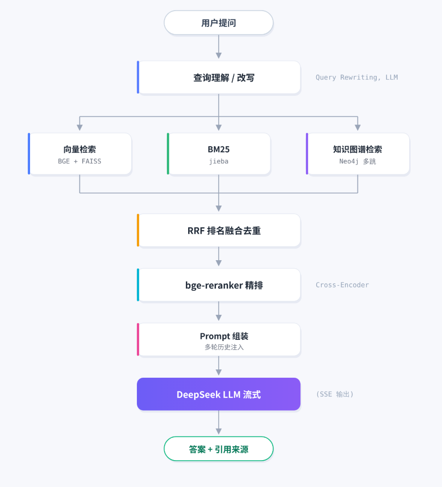

# 嘉庚智答 · 知识图谱增强 RAG 系统

> 基于 **LightRAG 思想** + **三路混合检索** + **Cross-Encoder 重排** 的领域知识库问答系统，面向陈嘉庚文献的智能问答场景。

[](https://www.python.org/)
[](https://fastapi.tiangolo.com/)
[](https://neo4j.com/)
[](#)

---

## 📖 项目简介

"嘉庚智答"是一个面向**陈嘉庚文献语料库**的智能问答系统。系统将《南侨回忆录》《陈嘉庚言论集》《新中国观感集》等文献构建为可检索的知识库，结合向量语义检索、关键词检索与知识图谱多跳推理，为用户提供**有引用、可溯源、低幻觉**的智能问答服务。

---

## ✨ 核心特性

| 能力 | 技术实现 |
|---|---|
| **三路混合检索** | BGE 向量语义检索（FAISS）+ BM25 关键词检索（jieba 分词）+ Neo4j 知识图谱多跳召回 |
| **重排精排** | bge-reranker-base 交叉编码器对候选块二次排序，提升 Top-K 相关性 |
| **知识图谱** | LLM 抽取实体-关系三元组，实体归一化后存入 Neo4j，支持 2 跳子图扩展 |
| **RRF 融合** | 三路召回结果用 Reciprocal Rank Fusion 去重排序，权重可配 |
| **多轮对话记忆** | 滑动窗口保留近 6 轮对话，超窗口自动 LLM 滚动摘要压缩 |
| **流式输出** | SSE Server-Sent Events 打字机效果，后台异步生成，切换对话不打断 |
| **图谱可视化** | vis-network 交互式知识图谱浏览，支持按实体展开邻居 |
| **引用溯源** | 每个答案附带来源书名、章节与原文片段，可点击查看 |
| **抗幻觉** | 对语料外问题具备拒答能力，评估集上幻觉识别率 100% |

---

## 🏗️ 系统架构

<p align="center">
  
</p>

### 离线索引构建流程

```
原始文献 (PDF/TXT)
    │
    ▼
文本清洗与解析
    │
    ▼
语义分块 (600字目标, 80字重叠)
    │
    ├──► BGE 向量化 ──► FAISS 索引
    │
    └──► LLM 三元组抽取 ──► 实体归一化 ──► Neo4j 图谱
```

---

## 🛠️ 技术栈

| 层次 | 选型 |
|---|---|
| **后端框架** | FastAPI + Uvicorn |
| **向量检索** | FAISS（IndexFlatIP 余弦相似度） |
| **嵌入模型** | BAAI/bge-base-zh-v1.5（本地加载） |
| **重排模型** | BAAI/bge-reranker-base（本地 Cross-Encoder） |
| **关键词检索** | BM25 + jieba 中文分词 |
| **知识图谱** | Neo4j 5.x（Bolt 协议） |
| **LLM** | DeepSeek-Chat API（OpenAI 兼容接口） |
| **对话存储** | SQLite + SQLAlchemy ORM |
| **前端** | 原生 HTML / JavaScript + vis-network + marked.js + DOMPurify |
| **流式传输** | SSE（Server-Sent Events） |

---

## 📁 项目结构

```
ChenJiageng-RAG/
├── src/                        # 后端核心代码
│   ├── app.py                  # FastAPI 主入口（路由 + SSE 流式）
│   ├── config.py               # 全局配置（路径、模型、超参数）
│   ├── rag_pipeline.py         # RAG 主流水线（编排各模块）
│   ├── query_analyzer.py      # 查询理解与改写
│   ├── hybrid_retriever.py     # 向量 + BM25 混合检索
│   ├── vector_store.py        # FAISS 向量索引与检索
│   ├── bm25_store.py          # BM25 索引与检索
│   ├── graph_retriever.py      # Neo4j 图谱检索与子图扩展
│   ├── reranker.py             # Cross-Encoder 重排
│   ├── rag_generator.py        # 答案生成（同步 + 流式）
│   ├── llm_client.py           # LLM 客户端（DeepSeek / Ollama 降级）
│   ├── chunker.py              # 文档语义分块
│   ├── kg_extractor.py         # 知识图谱三元组抽取
│   ├── kg_normalizer.py        # 实体归一化消歧
│   ├── kg_indexer.py           # 图谱实体/关系向量索引
│   ├── neo4j_importer.py       # 三元组批量导入 Neo4j
│   ├── milvus_migrator.py      # FAISS → Milvus 迁移脚本
│   ├── db.py                   # 会话与消息存储（SQLAlchemy）
│   ├── prompts.py              # 各类 Prompt 模板
│   └── evaluator.py            # 检索效果评估脚本
├── web/                        # 前端页面
│   ├── index.html              # 聊天问答界面
│   └── graph.html              # 知识图谱可视化
├── data/
│   ├── custom_dict.txt         # jieba 自定义词典
│   └── stopwords.txt           # 中文停用词表
├── .env.example                # 环境变量模板（复制为 .env 后填写）
├── requirements.txt            # Python 依赖
└── README.md
```

> 📌 `data/models/`、`data/chunks/`、`data/kg/`、`data/milvus/`、`data/raw/`、`data/clean/`、`data/vector_store/` 等目录存放语料、模型与索引文件，体积较大，已通过 `.gitignore` 排除。首次运行时按下方说明自行构建。

---

## 🚀 快速开始

### 环境要求

- Python 3.10+
- Neo4j 5.x（本地或远程，用于知识图谱）
- 一个 DeepSeek API Key（或本地 Ollama）

### 1. 克隆仓库

```bash
git clone https://github.com/alinj4253-droid/ChenJiageng-RAG.git
cd ChenJiageng-RAG
```

### 2. 安装依赖

```bash
pip install -r requirements.txt
```

### 3. 下载本地模型

嵌入与重排模型较大，需手动下载后放入 `data/models/`：

- **BAAI/bge-base-zh-v1.5**（嵌入模型，约 400MB）
- **BAAI/bge-reranker-base**（重排模型，约 1.1GB）

可使用 HuggingFace 命令行下载：

```bash
huggingface-cli download BAAI/bge-base-zh-v1.5 --local-dir data/models/models/BAAI--bge-base-zh-v1.5/snapshots/master
huggingface-cli download BAAI/bge-reranker-base --local-dir data/models/models/BAAI--bge-reranker-base/snapshots/master
```

### 4. 配置环境变量

```bash
cp .env.example .env
```

编辑 `.env`，填入你的 DeepSeek API Key 与 Neo4j 密码：

```env
OPENAI_API_BASE=https://api.deepseek.com/v1
OPENAI_API_KEY=sk-xxxxxxxxxxxxxxxx

NEO4J_URI=bolt://localhost:7687
NEO4J_USER=neo4j
NEO4J_PASSWORD=your_password
```

### 5. 准备数据与索引

将文献语料放入 `data/raw/`，然后依次运行：

```bash
# 1) 文本分块
python -m src.chunker

# 2) 构建向量索引
python -m src.vector_store

# 3) 抽取知识图谱三元组
python -m src.kg_extractor

# 4) 实体归一化
python -m src.kg_normalizer

# 5) 构建图谱向量索引
python -m src.kg_indexer

# 6) 导入 Neo4j
python -m src.neo4j_importer
```

### 6. 启动服务

```bash
python -m uvicorn src.app:app --host 0.0.0.0 --port 8000
```

浏览器访问：

| 页面 | 地址 |
|---|---|
| 聊天问答 | http://localhost:8000 |
| 知识图谱可视化 | http://localhost:8000/graph |
| API 文档（Swagger） | http://localhost:8000/docs |

---

## 🔌 主要 API

| 方法 | 路径 | 说明 |
|---|---|---|
| POST | `/api/chat` | 同步问答 |
| POST | `/api/chat/stream` | SSE 流式问答（推荐） |
| GET | `/api/sessions` | 会话列表 |
| GET | `/api/sessions/{id}/messages` | 会话历史消息 |
| POST | `/api/sessions` | 新建会话 |
| DELETE | `/api/sessions/{id}` | 删除会话 |
| GET | `/api/graph?entity=陈嘉庚` | 获取图谱子图数据 |
| GET | `/api/health` | 健康检查 |

---

## 📊 评估结果

在 30 道领域测试题上的检索与问答准确率对比：

| 检索策略 | 准确率 |
|---|---|
| 纯向量检索（Baseline） | 93.3% |
| 向量 + BM25 混合检索 | 93.3% |
| **混合检索 + 知识图谱 + Rerank（全流程）** | **100%** |

> 幻觉识别率：100%（系统能准确识别语料中不存在的问题并礼貌拒答）。

---

## 🧠 关键技术点说明

- **RRF 融合**：三路召回结果互不相识，用 Reciprocal Rank Fusion（k=60）将不同排序尺度的结果归一化融合，避免某一路分数碾压。
- **实体归一化**：LLM 抽取的实体存在别名与指称差异，通过编辑距离 + 向量相似度聚类合并，再回写到三元组。
- **后台异步流式**：SSE 接口不直接在请求线程里生成，而是把生成任务放到 `asyncio.create_task`，前端通过轮询任务状态拉取增量 token——即使前端切走再回来，回答也不会中断。
- **滚动摘要**：每满 6 轮对话，用 LLM 将旧对话压缩成 200 字摘要，注入下一轮 system prompt，控制上下文长度。

---

## 📝 License

本项目仅供学习与交流使用，请勿用于商业用途。文献版权归原作者与出版社所有。
